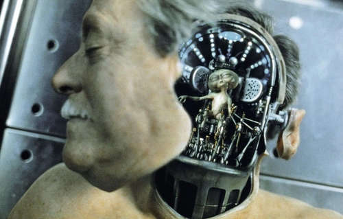

# Project Portfolio

In this portfolio, A group project will be discussed in detail with a focus on selection of the correct tools to build an artifact.

---

## The Artifact

For this Project a scaled version of a head with the following features:

*   A head with a hinged panel for access at the back.
*   Skin like look to create a finish.

The artifact is inspired by the 1997 series of Men In Black(MIB), where Rosenberg is revealed as a Mechanical human controlled by an alien.
 

Due to design and cost constraints, a few changes in approach have been made. The opening will be designed to allow access from the back of the head in order to meet a further additions of the project. The second addition will focus on creating eye movement. If the budget and time allow, an additional goal could be to add a speaker to play songs or speech.

# Design Process
This Diagram provides a high level overview of a proposed design process.

## MoSCoW

    Must:
        * Reverse engineer a Human head.
        * Evaluate Tools and methods in creation of a prototype.
        * Design a hinged joint.
    Should:
        * Include a moving component.
        * Include a Skin like design.
    Could:
        * Include a speaker system.
        * Have the ability to move eyes.
    Wont:
        * Be used in a Commercial application.
        * Contain motorised components.

## Reverse Engineering

The Head for the model will be Michael Alcock(The Author) _pictured in Fig. 1_. Designing a head from scratch in a CAD or sculpting software would take a long time and potentially miss out features. For this reason a method of reverse engineering the object was required.
    

<figcaption><i>Fig. 1 - Michael Alcock's head profile picture</i></figcaption>

Two scanners were trialled for the task. The first is a HandySCAN 3D Black Series from creaform3d.com <i>pictured in Fig.2</i>. This is a handheld unit that uses lasers to measure distance to the object and records the changes in shape as it moves across the surface. The measurement rate is incredibly fast at 1.3mil/s. and an accuracy of 0.025mm.

<figcaption><i>Fig 2. - https://www.creaform3d.com/en/portable-3d-scanner-handyscan-3d</i></figcaption>

The HandySCAN requires the object to use a method of location. These are reflective markers that increase the accuracy and allow the laser to map an area. These markers are best placed in a random format. The main limitation of the HandySCAN is it cannot deal with hair. Which is an issue for modelling heads. This is demonstrated in <i>Fig 3.</i> using Michael Alcock's head.

<figcaption><i>Fig 3. - Laser reflectors used for mapping surface areas.</i></figcaption>

The Software used to process the scan is VXElements, supplied by creaform3d.com and the screen capture shows the outcome of a scan. The area of beard hair is unmapped in the software as the lasers couldn’t work out what the surface was. This is evident in Fig 4.

<figcaption><i>Fig 4. - Laser scanned head after software processing.</i></figcaption>

The HandySCAN is more suited to scanning of manufactured parts with clear surfaces such as cars and aircraft.
<i>Fig. 4</i> demonstrates the limitations of the HandySCAN but also the incredible detail of the areas where the laser can detect. Based on the results of this experiment, this device would be unsuitable for this project without a lot of editing in a sculpting package, such as Blender, due to the amount of surface detail that is missing.

In comparison to the HandySCAN, the Artec Eva 3D scanner (https://www.artec3d.com, no date), is designed with modelling medium sized objects and is compatible with human skin, which is a well publicised feature on their website <i><a href="https://www.artec3d.com/cases/medical">Artec3d.com</a></i>. Unlike the HandySCAN using lasers to measure and map features, Artec Eva 3D uses light and photogrammetry to map the object. This method allows for software to use algorithms to “Stitch” the image together into a solid object and requires no markers to locate itself.

The benefit to the Artec Eva 3D for modelling a skin based object is its ability to handle different textures such as hair. <i>Fig. 5</i> is an image of a post processed scan. In comparison to <i>Fig. 4</i> there are no areas the scanner has been unable to map.

<figcaption><i>Fig 5. - Artec Eva 3D after processing.</i></figcaption>

The detail is remarkable. The hair has been handled well as reflectected in the overall model. It would be best to remove the bumps where the hair is present as this would make it easier to work with as a physical model.
To achieve this, a software package would be required. Blender is an option and will be discussed futher in the <b>Software Selection</b> portion of this portfolio along with an alternative method.

Another reverse engineering technique is Motion Capture which can generate movements into a 3 dimentional virtual models. This is a popular technology used in animated films. Warner Bros. used Motion capture for The Polar Express released in 2004 which is reviewed by Mark Harrisons (2020) review in <a href= "https://www.filmstories.co.uk/features/revisiting-the-performance-capture-animated-films-of-robert-zemeckis/">filmstories.co.uk</a>.

Motion Capture would be very useful for replicating the authors mouth movements or facial expressions, but this is beyond the scope of this artifact as the cost of making a model thats capable of producing the motions required for facial expressions.

    
## Software Selection

The software package required for processing images from Artec Eva 3D exports as .stl file format. This is a standard format for 3d file which is abbreviated from Standard Triangle Format or Standard Tessellation Format, depending on the source.

When working with the .stl file generated by the Artec Eva 3D, it is possible to import <i>Fig.5</i> directly into a CAD package such as Fusion 360 or Autocad. These types of CAD packages are best used for manufacturing of components like the Stand and hinge required for creating an opening at the back of the head as.

As previously mentioned, Blender would be a better choice for manipulation of a model like the head due to its built in sculpting tools <a href="https://www.blender.org/features/sculpting/">blender.org</a> (no date). Another advantage of using Blender is its open source licensing.
Blender takes a bit of getting used to but it is possible to use the brushes to smoothen an area and cutting tools for creating eyes which is a better method than trying to use CAD packages.

Touch sensitive devices which provide Haptic feedback could have also been an option for sculpting, <a href="https://www.3dsystems.com/haptics-devices/touch-x">3dsystems.com</a>. The Touch X is one of which the author has been trained on. A good use case for these types of devices is the training of surgeons. They provide feedback to the operator about pressure and surface contact.

Haptic devices can be used for robotic control, collison detection, mapping and more. For this project, Blender was used instead of a Haptic Pen for its simplicity and the software was easily installed and used without the need for specialist peripherals.

The haptic pen could have been used to touch up the model but blender was a preferred package as its tools are more familiar.

   
## Prototype Manufacture

There are a number of options for manufacturing a prototype depending on the budget and project requirements. 3d printers using Poly(lactic acid) or PLA for short, are a popular choice. The method requires the material to be heated and layered on top of itself. It is strong and can create complex srtructures(Sandip Kumar Mishra et al, 2021).

<figcaption><i>Fig 6. - Reduced size scanned head.</i></figcaption>

The 3d printer used in <i>Fig.6 </i> is an Ender 3 Pro by Creality. It is a lower end of the range of 3d Printers available on the market with a retail price of around £210 on <a href="https://www.amazon.co.uk/Creality-Official-Meanwell-Flexible-220x220x250mm/dp/B07GYRQVYV/ref=sr_1_1_sspa?keywords=ender+3+pro&qid=1680867612&sprefix=ender%2Caps%2C151&sr=8-1-spons&sp_csd=d2lkZ2V0TmFtZT1zcF9hdGY&psc=1">amazon.co.uk</a>.
The detail the printer is able to achieve is very good, The head in <i>Fig. 6</i> shows the contours in the skin that the scanner was able to map. The over hanging areas required the printer to add support structures seen on the ear and eyes.

Because the printed scan has been so successful and the detail achieved is remarkable, This method of prototype manufacturing has proven to be the best option.

Laser cutting was considered but this type of manufacturing technique is better for flat structures that dont require the detail of a face. A laser cutter would be an option for creating a baseplate using wood or Acrylic. Using these materials and cutting technique, 3D structures can be made by cutting multiple sections. An example of this can be found here: <a href="https://endurancelasers.com/how-to-laser-cut-3d-objects/">endurancelasers.com</a>

## Drone Skin Selection

A latex or resin material could make the appearance of the model more "Human Like". there are some great examples of Robotic applications which are nearly identical to the humans they were modelled on. One such example is Germinoid F (https://techresearchonline.com/, 2022), pictured in Fig 7 below, which is based on a twenty year old. It is possible to colour match the pigment of skin using a dye at the time of mixing, Which Fig 7 demonstrates how accurate the colours can be mixed to match a real humans skin pigment.

<figcaption><i>Fig 7. - Hiroshi Ishiguro's Germinoid F robot. (The robot is on the left!)</i></figcaption>

Latex or rubber is flexible enough for designers to use methods like wires attached to servos to create facial expressions and movements which replicate a human face. This would require a different approach to the design process. 
As the head is a top down design generating a solid prototype, it would be less suitable to try and use a technique such as rubber silicon, as casting a silicon mold over the head would require the removal of the ears and nose from the 3d printed head to allow the set cast to be removed. 
If a further prototype were commissioned, this would be an option if considered from the outset and the budget permitted its use.

As the final 3D print pictured in <i>Fig 8</i> has retained a high quality of detail as can be observed around the eyes which are clearly of a tired and stressed Final Year Student, it would be a shame to lose this level of detail by adding a thicker material which would deminish.

Another method which may be more suitable for the head prototype would be to spray it. This would retain the detail and create a nice finish.

<figcaption><i>Fig 8. - Final print of 3D printed Head. </i></figcaption>

## Preparing the prototype for finishing touches

Before applying the paint skin finish the printed head needs: 
    <li>Two door sections cutting out the back of the head.</li>
    <li>Filler applied to the areas that require smoothing</li>
 

<figcaption><i>Fig 9. - preparing the Cuts of doors into the head. </i></figcaption>

<figcaption><i>Fig 10. - preparing the Cuts of doors into the head. </i></figcaption>

<figcaption><i>Fig 11. - Two panels that will be used as doors. </i></figcaption>

<figcaption><i>Fig 12. - Two panels that will be used as doors. </i></figcaption>

<figcaption><i>Fig 13. - Panels placed bad in gap. </i></figcaption>

<figcaption><i>Fig 14. - repaired damage to join caused by dremmel. </i></figcaption>

<figcaption><i>Fig 15. - Filling the gap where the dremmel cut. </i></figcaption>

<figcaption><i>Fig 16. - Smoothening the 3D printing layer lines. </i></figcaption>

## Finishing Touches

<figcaption><i>Fig 16. - Final Primer filler coat of four applications. </i></figcaption>

<figcaption><i>Fig 17. - Final Primer coat of four applications. </i></figcaption>

<figcaption><i>Fig 18. - Final Primer coat of four applications. </i></figcaption>

## Conclusion

## References

creaform3d.com(2022) Available at: https://www.creaform3d.com/en/portable-3d-scanner-handyscan-3d/technical-specifications (Accessed: 06/04/2023).

artec3d.com(2023) Available at: https://www.artec3d.com/portable-3d-scanners/artec-eva (Accessed: 06/04/2023).

Harrison, M (2020)<i>Revisiting the performance-capture animated films of Robert Zemeckis</i> Available at: https://www.filmstories.co.uk/features/revisiting-the-performance-capture-animated-films-of-robert-zemeckis/ (Accessed: 06/04/2023).

https://www.3dsystems.com/haptics-devices/touch-x (No date)(Accessed: 07/04/2023).

Sandip Kumar Mishra et al.(2021) 'MECHANICAL PROPERTIES OF FIBRE/ FILLER BASED POLY(LACTIC ACID) (PLA) COMPOSITES : A BRIEF REVIEW', <i>Acta Innovations</i> Available at: https://doi.org/10.32933/ActaInnovations.41.1

https://www.amazon.co.uk/Creality-Official-Meanwell-Flexible-220x220x250mm/dp/B07GYRQVYV/ref=sr_1_1_sspa?keywords=ender+3+pro&qid=1680867612&sprefix=ender%2Caps%2C151&sr=8-1-spons&sp_csd=d2lkZ2V0TmFtZT1zcF9hdGY&psc=1 (no date)(Accessed:07/04/2023).

How to Laser-Cut 3D Objects (2019) Available at: https://endurancelasers.com/how-to-laser-cut-3d-objects/ 

TRO, (2022) "Sophia and Other 11 Best Humanoid Robots of 2022". Available at: https://techresearchonline.com/blog/sophia-and-11-humanoid-robots-2022/. (Accessed: 13/04/2023).